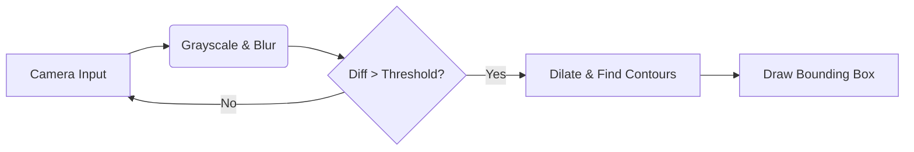

# Moving Object Detection 

> **A real-time computer vision system designed for automated surveillance and motion tracking.**

## 📌 Project Overview
This project is a high-performance **Motion Detection System** built with **Python** and **OpenCV**. It empowers users to monitor video feeds in real-time, automatically detecting and highlighting moving objects. By leveraging advanced image processing techniques like **Gaussian Blurring** and **Background Subtraction**, the system filters out noise and focuses strictly on significant movement, making it ideal for security and surveillance applications.

## 🚀 Key Features
*   **Real-time Motion Tracking:** Captures live video streams and processes frames instantly to distinguish movement.
*   **Intelligent Background Subtraction:** Automatically calculates pixel-identifiable differences between the current frame and a reference background.
*   **Visual Alert System:** Dynamically draws **green bounding boxes** around detected objects and updates on-screen status to warn users.
*   **Noise Reduction:** Implements Gaussian Blur to smooth video input, preventing false detections from minor lighting shifts or camera grain.

## 🛠️ Technical Stack

| Category | Technology | Usage |
| :--- | :--- | :--- |
| **Language** | **Python 3.x** | Core logic and scripting. |
| **Computer Vision** | **OpenCV (`cv2`)** | Image processing, frame capture, and contour detection. |
| **Utilities** | **Imutils** | Image resizing and ease-of-use helpers. |
| **Processing** | **NumPy** | High-speed array operations (implicit in OpenCV). |

## 📐 System Architecture

The system operates on a linear processing pipeline. For a detailed technical breakdown and flowcharts, please refer to [PROJECT_ARCHITECTURE.md](./PROJECT_ARCHITECTURE.md).



## ⚙️ How It Works
1.  **Initialization**: The camera starts and captures the **First Frame**, storing it as the "static background" reference.
2.  **Pre-Processing**: Incoming frames are resized, converted to grayscale, and blurred to remove high-frequency noise.
3.  **Difference Calculation**: The system computes the `absolute difference` between the current frame and the reference frame.
4.  **Thresholding**: Differences are converted to binary (Black/White). Only clusters of white pixels (movement) are kept.
5.  **Object Detection**: Contours are drawn around these clusters. If a contour's area exceeds **500 pixels**, it is marked as a moving object.

## 📦 Installation & Usage

**1. Prerequisites**
Ensure you have Python installed. You will need the following libraries:

```bash
pip install opencv-python imutils
```

**2. Running the Project**
Navigate to the project directory and run the script:

```bash
python MovingObjectDetection.py
```

**3. Controls**
*   The system opens a window showing the live camera feed.
*   **"Normal"**: Status when no motion is detected.
*   **"Moving Object Detected"**: Status when motion is tracked.
*   **Quit**: Press `q` to close the application.

## 👨‍💻 Author

| Information | Details |
| :--- | :--- |
| **Name** | **G.Rajesh** |
| **Registration No** | **12219956** |
| **Email** | @gmail.com |gogudupalemrajesh62@gmail.com
